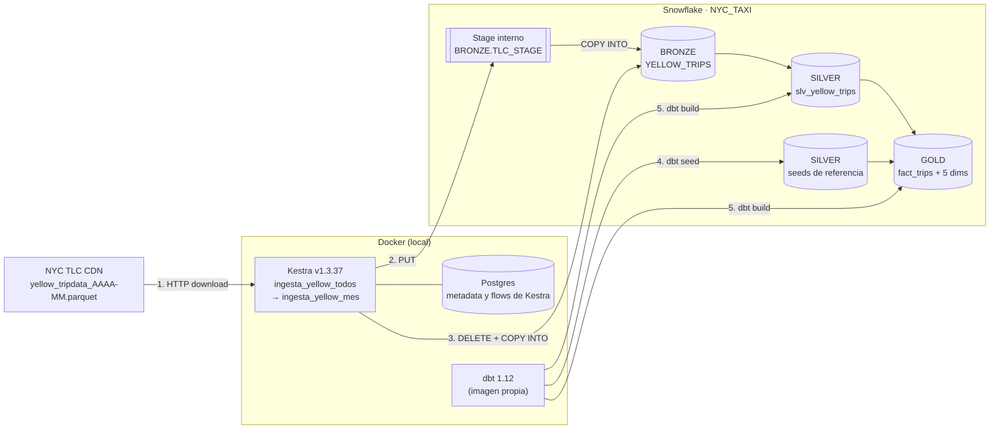
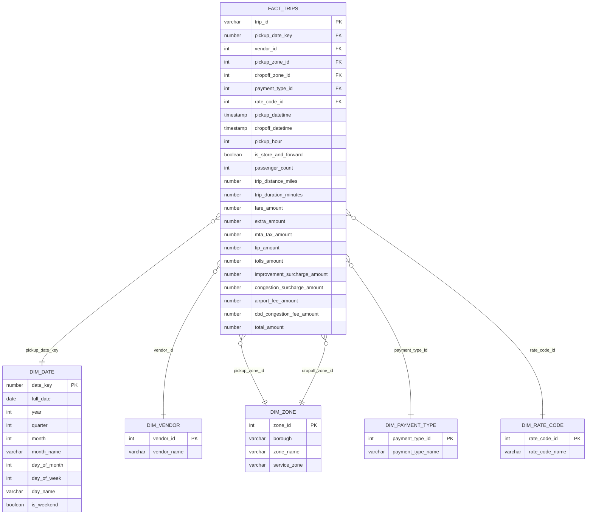

# Laboratorio Integrador I — ELT de NYC Yellow Taxi

Tubería ELT reproducible que ingiere los datos de NYC Yellow Taxi (enero 2025 – agosto 2026, 20 meses),
los carga en Snowflake y los transforma con dbt siguiendo una arquitectura **Bronze → Silver → Gold**.

## Diagrama de arquitectura



| Componente | Tecnología | Dónde corre |
|---|---|---|
| Orquestación e ingesta | Kestra v1.3.37 (+ Postgres para su metadata) | Docker, en local |
| Data warehouse | Snowflake (warehouse `NYC_WH`, XSMALL) | Nube |
| Transformaciones y tests | dbt-core 1.12 + dbt-snowflake | Docker (`infra/dbt/Dockerfile`) |

## Diagrama del esquema estrella (Gold)



## Estructura del proyecto

```
Laboratorio1/
├── infra/
│   ├── snowflake/00_setup.sql       # warehouse, base de datos, schemas, rol y usuario
│   └── dbt/Dockerfile               # imagen con Python 3.12 + dbt-snowflake
├── docker-compose.yml               # Kestra + Postgres de Kestra + dbt (profile "tools")
├── ingestion/test_conexion.py       # prueba rápida de credenciales de Snowflake
├── dbt/
│   ├── dbt_project.yml
│   ├── profiles.yml                 # lee las credenciales desde variables de entorno
│   ├── macros/generate_schema_name.sql
│   ├── seeds/                       # diccionario TLC: zonas, vendors, formas de pago, tarifas
│   └── models/
│       ├── bronze/sources.yml       # tabla cargada por Kestra (source)
│       ├── silver/slv_yellow_trips.sql / .yml
│       └── gold/fact_trips.sql / .yml, dim_*.sql, dims.yml
├── .env.example                     # variables necesarias, sin secretos
└── .gitignore
```

## Requisitos

- Docker Desktop, con al menos unos 15 GB libres en disco
- Una cuenta de Snowflake (el trial sirve)

## Cómo ejecutar desde cero

### 1. Preparar Snowflake

En un Worksheet de Snowflake, abre [infra/snowflake/00_setup.sql](infra/snowflake/00_setup.sql),
cambia `<TU_PASSWORD>` por una contraseña y ejecuta todo con **Cmd/Ctrl + Shift + Enter**.

El script crea:
- el warehouse `NYC_WH` (XSMALL, se suspende a los 60 s);
- la base de datos `NYC_TAXI` con los schemas `BRONZE`, `SILVER` y `GOLD`;
- el rol `NYC_ROLE`, con permisos solo sobre ese proyecto;
- el usuario de servicio `NYC_SVC` (`TYPE = LEGACY_SERVICE`, para que Kestra y dbt se conecten sin MFA).

El script usa `IF NOT EXISTS`, así que se puede ejecutar varias veces.

El *account identifier* se encuentra en: menú de tu usuario (abajo a la izquierda) → Account → View account details.

### 2. Configurar las variables

```bash
cp .env.example .env
```

Completa en `.env` el `SNOWFLAKE_ACCOUNT`, el `SNOWFLAKE_PASSWORD` y el `KESTRA_PASSWORD`. Escribe los valores **sin comillas**.

### 3. Probar la conexión a Snowflake (opcional)

```bash
docker run --rm --env-file .env -v "$PWD/ingestion:/app" python:3.12-slim \
  sh -c "pip install snowflake-connector-python && python /app/test_conexion.py"
```

Resultado esperado: `Conexión OK: ('NYC_SVC', 'NYC_ROLE', 'NYC_WH')`.

### 4. Levantar la infraestructura

```bash
docker compose up -d
docker compose ps          # kestra-db (healthy) y kestra (running)
docker compose build dbt   # construye la imagen de dbt
```

Abre Kestra en http://localhost:8080.

### 5. Ingesta con Kestra (→ BRONZE)

Los flows se crean en la interfaz de Kestra (**Flows → Create**) y Kestra los guarda en su base de datos,
dentro del volumen de Docker `kestra-db-data`. Hay dos flows en el namespace `lab1.nyc_taxi`:

- `ingesta_yellow_mes`: carga UN mes a BRONZE (input `periodo`, formato `AAAA-MM`).
- `ingesta_yellow_todos`: un `ForEach` sobre los 20 periodos (de 2 en 2) que llama a `ingesta_yellow_mes` como `Subflow`.

Ejecuta **`ingesta_yellow_todos`**. Cada ejecución de un mes hace lo siguiente:

1. `crear_objetos`: crea el file format, el stage y la tabla `BRONZE.YELLOW_TRIPS`, si no existen.
2. `descargar`: descarga `yellow_tripdata_AAAA-MM.parquet` desde el CDN de NYC TLC.
3. `subir_a_stage`: hace un `PUT` del archivo al stage interno `@NYC_TAXI.BRONZE.TLC_STAGE/yellow/`.
4. `cargar_bronze`: hace un `DELETE` de ese archivo y luego un `COPY INTO`, lo que lo hace **idempotente**.
5. `limpiar_archivos`: borra el parquet del almacenamiento interno de Kestra.

> ⚠️ `docker compose down -v` borra los volúmenes y, con ellos, los flows. Para detener Kestra sin perderlos, usa `docker compose down` (sin `-v`).

### 6. Transformaciones con dbt (→ SILVER y GOLD)

```bash
docker compose run --rm dbt debug   # comprueba la conexión ("All checks passed!")
docker compose run --rm dbt build   # seeds + Silver + Gold + todos los tests
```

`dbt build` ejecuta todo en orden de dependencias: seeds → `slv_yellow_trips` → dimensiones → `fact_trips`,
y corre los tests de cada modelo justo después de crearlo.

### 7. Verificar

```sql
USE ROLE NYC_ROLE;
USE WAREHOUSE NYC_WH;

SELECT 'bronze' AS capa, COUNT(*) AS filas FROM NYC_TAXI.BRONZE.YELLOW_TRIPS
UNION ALL SELECT 'silver', COUNT(*) FROM NYC_TAXI.SILVER.SLV_YELLOW_TRIPS
UNION ALL SELECT 'gold_fact', COUNT(*) FROM NYC_TAXI.GOLD.FACT_TRIPS;
```

Consulta de ejemplo sobre el esquema estrella:

```sql
SELECT d.month_name, z.borough AS borough_origen, p.payment_type_name,
       COUNT(*) AS viajes, ROUND(AVG(f.total_amount), 2) AS ticket_promedio
FROM NYC_TAXI.GOLD.FACT_TRIPS f
JOIN NYC_TAXI.GOLD.DIM_DATE d         ON f.pickup_date_key = d.date_key
JOIN NYC_TAXI.GOLD.DIM_ZONE z         ON f.pickup_zone_id  = z.zone_id
JOIN NYC_TAXI.GOLD.DIM_PAYMENT_TYPE p ON f.payment_type_id = p.payment_type_id
WHERE d.year = 2025
GROUP BY 1, 2, 3
ORDER BY viajes DESC
LIMIT 10;
```

## Resultados

| Capa | Objeto | Filas |
|---|---|---:|
| Bronze | `BRONZE.YELLOW_TRIPS` | 75.089.241 |
| Silver | `SILVER.SLV_YELLOW_TRIPS` | 70.950.992 (se descartó el 5,5 %) |
| Gold | `GOLD.FACT_TRIPS` | 70.950.992 |
| Gold | `dim_date` / `dim_zone` / `dim_vendor` / `dim_payment_type` / `dim_rate_code` | 730 / 265 / 4 / 7 / 7 |

Tests de dbt: **40 en total, todos en PASS**. Hay 2 en Bronze, 13 en Silver, 10 en las dimensiones y 15 en el hecho.

## Decisiones de diseño

### Bronze: lo más cercano a la fuente

- **Sin transformaciones.** Las columnas conservan los nombres originales del parquet.
- **Metadata de linaje.** `SOURCE_FILE` guarda el archivo de origen, del que se deduce el periodo, y `LOADED_AT` guarda la fecha y hora de la carga (`METADATA$START_SCAN_TIME`).
- **`MATCH_BY_COLUMN_NAME = CASE_INSENSITIVE`.** Las columnas se emparejan por nombre y no por posición. El esquema de TLC cambia con el tiempo (en 2025 apareció `cbd_congestion_fee`), y así la carga no se rompe si un archivo trae o deja de traer una columna.
- **`USE_LOGICAL_TYPE = TRUE`.** Los timestamps del parquet se leen como fechas y no como enteros.
- **Idempotencia.** Antes de cada `COPY INTO` se borran las filas de ese mismo `SOURCE_FILE`, y el `COPY` usa `FORCE = TRUE`. Si un mes se vuelve a ejecutar, se reemplaza en lugar de duplicarse.

### Silver: limpieza justificada con perfilado

Antes de limpiar se perfilaron los 75.089.241 registros de Bronze:

| Hallazgo | Filas | % |
|---|---:|---:|
| `passenger_count`, `RatecodeID` y `store_and_fwd_flag` nulos a la vez (todos con `payment_type = 0`, Flex Fare) | 18.407.401 | 24,5 % |
| Distancia ≤ 0 | 2.236.130 | 3,0 % |
| Tarifa < 0 pero total ≥ 0 (ajustes propios de Flex Fare) | 1.879.991 | 2,5 % |
| Total < 0 (reembolsos, disputas, anulaciones) | 1.121.063 | 1,5 % |
| Dropoff anterior o igual al pickup (casi todos con hora idéntica) | 874.802 | 1,2 % |
| Pasajeros = 0 o > 6 | 344.113 | 0,5 % |
| Duplicados exactos | 13.547 | 0,0 % |
| Distancia > 200 millas (máximo: 397.994) | 2.889 | 0,0 % |
| Viajes de más de 24 h | 540 | 0,0 % |
| Pickup fuera del mes del archivo (hay fechas de 2001) | 345 | 0,0 % |
| Vendor, zona o forma de pago fuera del diccionario TLC | 0 | 0 % |

Decisiones tomadas:

| Dimensión de calidad | Decisión | Justificación |
|---|---|---|
| **Nombres y formatos** | Columnas en `snake_case` descriptivo (`VENDORID` → `vendor_id`, `TPEP_PICKUP_DATETIME` → `pickup_datetime`, montos con sufijo `_amount`). `store_and_fwd_flag` Y/N pasa a booleano `is_store_and_forward` | Nombres consistentes y autoexplicativos para Gold |
| **Tipos** | IDs a `INTEGER`, montos y distancias a `NUMBER(10,2)` | En la fuente, `passenger_count` y `RatecodeID` venían como decimales (1.0) |
| **Nulos** | Se **conservan** los viajes Flex Fare. `rate_code_id` nulo pasa a **99** ("Unknown" en el diccionario TLC). `passenger_count` queda **NULL** | Son el 24,5 % de los viajes, con distancias y montos normales. Borrarlos sesgaría el análisis, y no se inventan pasajeros |
| **Valores inválidos corregibles** | `passenger_count` en 0 o mayor que 6 pasa a NULL | El viaje es válido y solo el dato de pasajeros es incorrecto |
| **Registros inválidos (se descartan)** | Duración ≤ 0 o mayor a 24 h · distancia ≤ 0 o mayor a 200 millas · total < 0 o mayor a $1.000 · pickup fuera del mes del archivo | No representan un viaje analizable: son taxímetros encendidos sin viaje, errores del equipo, reembolsos o fechas corruptas |
| **Duplicados** | `QUALIFY ROW_NUMBER()` por (vendor, pickup, dropoff, zonas, distancia, total), conservando la carga más reciente | Dos viajes reales no pueden coincidir en todos esos campos |
| **Tarifa negativa con total positivo** | Se **conservan** | Es el comportamiento de Flex Fare, no un error |

`trip_id` es un hash MD5 de las columnas que identifican al viaje. Es la clave única de Silver y la PK del hecho.

### Gold: esquema estrella

- **Grano de `fact_trips`:** un registro por viaje válido de taxi amarillo.
- **PK del hecho:** `trip_id`. **PK de las dimensiones:** el código natural del diccionario TLC (`vendor_id`, `zone_id`, `payment_type_id`, `rate_code_id`) y `date_key` con formato AAAAMMDD. Son códigos estables y pequeños, así que no hace falta una surrogate key adicional.
- **FKs:** `pickup_date_key`, `vendor_id`, `pickup_zone_id`, `dropoff_zone_id`, `payment_type_id` y `rate_code_id`.
- **`dim_zone` es de rol múltiple:** la misma dimensión se usa como zona de origen y como zona de destino.
- **Métricas:** pasajeros, distancia, duración y todos los componentes del cobro (tarifa, extras, impuestos, propina, peajes, recargos y total).
- **Atributos del viaje en el hecho:** timestamps exactos, `pickup_hour` e `is_store_and_forward`.
- **Origen de las dimensiones:** `dim_date` se genera con `GENERATOR` (2025-01-01 a 2026-12-31). Las demás salen de *seeds* con el diccionario oficial de TLC y el Taxi Zone Lookup.

### Validación y re-ejecución

- **`not_null` y `unique`** en la PK de cada dimensión y del hecho, y en las columnas clave de Silver.
- **`relationships`** en las 6 FKs de `fact_trips`, para que no queden viajes sin dimensión.
- **`accepted_values`** en Silver para vendor, forma de pago y tarifa.
- **Idempotencia comprobada.** Se ejecutaron dos veces la ingesta de 2025-01 y `dbt build`, y los conteos no cambiaron. Los modelos de dbt son `table`, así que cada ejecución reemplaza la tabla en lugar de insertar filas.

## Disponibilidad de los datos

NYC TLC publica cada mes con unos 2 meses de retraso. Al 2026-09-28, **2026-08 todavía no está publicado**:
el CDN responde 403. El flow padre usa `allowFailure: true`, así que carga los 19 meses disponibles y marca
el faltante en estado WARNING. Cuando TLC lo publique, basta con volver a ejecutar `ingesta_yellow_todos`
y luego `dbt build`, sin riesgo de duplicados.

## Problemas encontrados y soluciones

| Problema | Causa | Solución |
|---|---|---|
| `User 'NYC_SVC' does not exist or not authorized` | En Snowflake, `Cmd + Enter` ejecuta solo la sentencia bajo el cursor | Ejecutar todo con `Cmd + Shift + Enter` |
| Docker se congelaba y no respondía | Disco casi lleno (5 GB libres) | Liberar espacio en disco (más de 15 GB libres) |
| `crear_objetos.url: must not be null` | `pluginDefaults` con un tipo genérico no se aplicaba | Usar el tipo exacto: `...snowflake.Queries` y `...snowflake.Upload` |
| `Actual statement count 3 did not match the desired statement count 1` | Por defecto Snowflake acepta una sola sentencia por llamada | Agregar `&MULTI_STATEMENT_COUNT=0` a la URL JDBC |
| `Illegal character in path ... {{ inputs.periodo }}` | Kestra no evalúa las expresiones que hay dentro de `variables` | Usar `{{ render(vars.archivo) }}` |
| Errores `169.254.169.254` / `metadata.google.internal` en los logs | El driver de Snowflake intenta detectar si corre en AWS, Azure o GCP | Son inofensivos y se pueden ignorar |
| dbt no corría con Python 3.8 local | dbt 1.12 requiere Python 3.10 o más | dbt en Docker con imagen propia (`python:3.12-slim`) |
| `dbt debug`: `git [ERROR]` | `python:3.12-slim` no trae git | Instalar git en el Dockerfile |
| `invalid identifier '"LocationID"'` en `dim_zone` | Snowflake guardó las columnas del seed en MAYÚSCULAS | Referenciarlas sin comillas |
